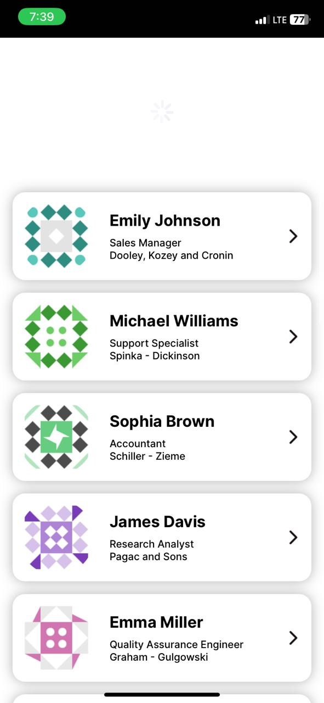

# This is an assignment given my lifology

Developed a mobile application that fetches and displays a list of users from the DummyJson API. The app will allow users to view a list of posts by each user with infinite scrolling to load more content as needed.

## Steps to start locally

 - Clone the git repo locally
 - Run `npm install` command to install all dependencies
 - Run `npm start` to run in expo go

# Below are the Screenshots from the app (ios)

